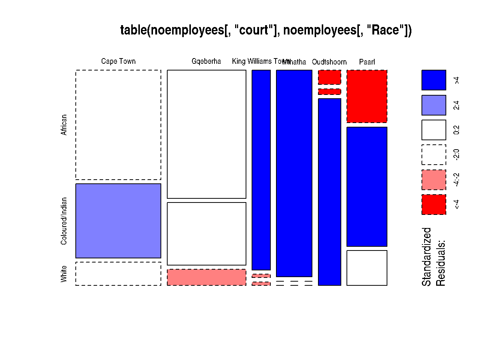

# Transport and context


Respondents were asked *Q8_1. Which main place, area, community or village did you travel from to get to the court today? *. The responses were used to derive estimates of the distance travelled to be in court.  This shows that the average travel distance (as the crow flies) between place of origin and court ranged from 20Km in Cape Town to 137km for Mthatha court.


Typically about one-fifth of respondents travelled from more than 20Km away.  The proportion of respondents travelling more than 20km was a little as 17\%  in Paarl and Gqeberha. At the other end of the spectrum King Williams Town and Mthatha 41\% and 51\%  of respondents (respectively) travelled more than 20km to be in court.

The modes of transport used to get to court has to be understood through the interactions of distance travelled, transport infrastructure and income. 

Distance that respondents had to travel to be in court is reflected in how often they were in court. For example witnesses who had to travel more than 20k had been to court 2.7 times as opposed to the three (2.98)  times for those travelling less than 20km. In other words those who travelled further returned to court less often. The comparative figures for those obtaining a court order was 3.6 times (more than 20km travel) as opposed to 3.9 times for those travelling less than that amount. It is not known how many more times respondents would have to return to court to complete their cases.

The only category running counter to this trend were the *accused* who returned to court marginally more often if they travelled more than 20km. (3.8 versus 3.5).


Race and court
----------------
There are strong correlations between court location and the demographic composition of people in that court. Mthatha and Oudtshoorn courts are the two that differ most markedly.


<br>




<table>
 <thead>
  <tr>
   <th style="text-align:left;">   </th>
   <th style="text-align:right;"> African </th>
   <th style="text-align:right;"> Coloured/Indian </th>
   <th style="text-align:right;"> White </th>
  </tr>
 </thead>
<tbody>
  <tr>
   <td style="text-align:left;"> Cape Town </td>
   <td style="text-align:right;"> 146 </td>
   <td style="text-align:right;"> 99 </td>
   <td style="text-align:right;"> 31 </td>
  </tr>
  <tr>
   <td style="text-align:left;"> Gqeberha </td>
   <td style="text-align:right;"> 158 </td>
   <td style="text-align:right;"> 77 </td>
   <td style="text-align:right;"> 20 </td>
  </tr>
  <tr>
   <td style="text-align:left;"> King Williams Town </td>
   <td style="text-align:right;"> 57 </td>
   <td style="text-align:right;"> 1 </td>
   <td style="text-align:right;"> 1 </td>
  </tr>
  <tr>
   <td style="text-align:left;"> Mthatha </td>
   <td style="text-align:right;"> 115 </td>
   <td style="text-align:right;"> 0 </td>
   <td style="text-align:right;"> 0 </td>
  </tr>
  <tr>
   <td style="text-align:left;"> Oudtshoorn </td>
   <td style="text-align:right;"> 5 </td>
   <td style="text-align:right;"> 2 </td>
   <td style="text-align:right;"> 66 </td>
  </tr>
  <tr>
   <td style="text-align:left;"> Paarl </td>
   <td style="text-align:right;"> 33 </td>
   <td style="text-align:right;"> 75 </td>
   <td style="text-align:right;"> 22 </td>
  </tr>
</tbody>
</table>


The 


```{=html}
<div class="tabwid"><style>.cl-201e3312{}.cl-201742be{font-family:'DejaVu Sans';font-size:8pt;font-weight:bold;font-style:normal;text-decoration:none;color:rgba(0, 0, 0, 1.00);background-color:transparent;}.cl-201742dc{font-family:'DejaVu Sans';font-size:8pt;font-weight:normal;font-style:normal;text-decoration:none;color:rgba(0, 0, 0, 1.00);background-color:transparent;}.cl-201a3c44{margin:0;text-align:left;border-bottom: 0 solid rgba(0, 0, 0, 1.00);border-top: 0 solid rgba(0, 0, 0, 1.00);border-left: 0 solid rgba(0, 0, 0, 1.00);border-right: 0 solid rgba(0, 0, 0, 1.00);padding-bottom:5pt;padding-top:5pt;padding-left:5pt;padding-right:5pt;line-height: 1;background-color:transparent;}.cl-201a512a{width:2in;background-color:rgba(207, 207, 207, 1.00);vertical-align: middle;border-bottom: 0 solid rgba(0, 0, 0, 1.00);border-top: 0 solid rgba(0, 0, 0, 1.00);border-left: 0 solid rgba(0, 0, 0, 1.00);border-right: 0 solid rgba(0, 0, 0, 1.00);margin-bottom:0;margin-top:0;margin-left:0;margin-right:0;}.cl-201a513e{width:1.77in;background-color:rgba(207, 207, 207, 1.00);vertical-align: middle;border-bottom: 0 solid rgba(0, 0, 0, 1.00);border-top: 0 solid rgba(0, 0, 0, 1.00);border-left: 0 solid rgba(0, 0, 0, 1.00);border-right: 0 solid rgba(0, 0, 0, 1.00);margin-bottom:0;margin-top:0;margin-left:0;margin-right:0;}.cl-201a5152{width:1.133in;background-color:rgba(207, 207, 207, 1.00);vertical-align: middle;border-bottom: 0 solid rgba(0, 0, 0, 1.00);border-top: 0 solid rgba(0, 0, 0, 1.00);border-left: 0 solid rgba(0, 0, 0, 1.00);border-right: 0 solid rgba(0, 0, 0, 1.00);margin-bottom:0;margin-top:0;margin-left:0;margin-right:0;}.cl-201a515c{width:1.272in;background-color:rgba(207, 207, 207, 1.00);vertical-align: middle;border-bottom: 0 solid rgba(0, 0, 0, 1.00);border-top: 0 solid rgba(0, 0, 0, 1.00);border-left: 0 solid rgba(0, 0, 0, 1.00);border-right: 0 solid rgba(0, 0, 0, 1.00);margin-bottom:0;margin-top:0;margin-left:0;margin-right:0;}.cl-201a5170{width:1.327in;background-color:rgba(207, 207, 207, 1.00);vertical-align: middle;border-bottom: 0 solid rgba(0, 0, 0, 1.00);border-top: 0 solid rgba(0, 0, 0, 1.00);border-left: 0 solid rgba(0, 0, 0, 1.00);border-right: 0 solid rgba(0, 0, 0, 1.00);margin-bottom:0;margin-top:0;margin-left:0;margin-right:0;}.cl-201a517a{width:2in;background-color:transparent;vertical-align: middle;border-bottom: 0 solid rgba(0, 0, 0, 1.00);border-top: 0 solid rgba(0, 0, 0, 1.00);border-left: 0 solid rgba(0, 0, 0, 1.00);border-right: 0 solid rgba(0, 0, 0, 1.00);margin-bottom:0;margin-top:0;margin-left:0;margin-right:0;}.cl-201a518e{width:1.77in;background-color:transparent;vertical-align: middle;border-bottom: 0 solid rgba(0, 0, 0, 1.00);border-top: 0 solid rgba(0, 0, 0, 1.00);border-left: 0 solid rgba(0, 0, 0, 1.00);border-right: 0 solid rgba(0, 0, 0, 1.00);margin-bottom:0;margin-top:0;margin-left:0;margin-right:0;}.cl-201a51a2{width:1.133in;background-color:transparent;vertical-align: middle;border-bottom: 0 solid rgba(0, 0, 0, 1.00);border-top: 0 solid rgba(0, 0, 0, 1.00);border-left: 0 solid rgba(0, 0, 0, 1.00);border-right: 0 solid rgba(0, 0, 0, 1.00);margin-bottom:0;margin-top:0;margin-left:0;margin-right:0;}.cl-201a51ac{width:1.272in;background-color:transparent;vertical-align: middle;border-bottom: 0 solid rgba(0, 0, 0, 1.00);border-top: 0 solid rgba(0, 0, 0, 1.00);border-left: 0 solid rgba(0, 0, 0, 1.00);border-right: 0 solid rgba(0, 0, 0, 1.00);margin-bottom:0;margin-top:0;margin-left:0;margin-right:0;}.cl-201a51c0{width:1.327in;background-color:transparent;vertical-align: middle;border-bottom: 0 solid rgba(0, 0, 0, 1.00);border-top: 0 solid rgba(0, 0, 0, 1.00);border-left: 0 solid rgba(0, 0, 0, 1.00);border-right: 0 solid rgba(0, 0, 0, 1.00);margin-bottom:0;margin-top:0;margin-left:0;margin-right:0;}.cl-201a51ca{width:2in;background-color:rgba(239, 239, 239, 1.00);vertical-align: middle;border-bottom: 0 solid rgba(0, 0, 0, 1.00);border-top: 0 solid rgba(0, 0, 0, 1.00);border-left: 0 solid rgba(0, 0, 0, 1.00);border-right: 0 solid rgba(0, 0, 0, 1.00);margin-bottom:0;margin-top:0;margin-left:0;margin-right:0;}.cl-201a51de{width:1.77in;background-color:rgba(239, 239, 239, 1.00);vertical-align: middle;border-bottom: 0 solid rgba(0, 0, 0, 1.00);border-top: 0 solid rgba(0, 0, 0, 1.00);border-left: 0 solid rgba(0, 0, 0, 1.00);border-right: 0 solid rgba(0, 0, 0, 1.00);margin-bottom:0;margin-top:0;margin-left:0;margin-right:0;}.cl-201a51e8{width:1.133in;background-color:rgba(239, 239, 239, 1.00);vertical-align: middle;border-bottom: 0 solid rgba(0, 0, 0, 1.00);border-top: 0 solid rgba(0, 0, 0, 1.00);border-left: 0 solid rgba(0, 0, 0, 1.00);border-right: 0 solid rgba(0, 0, 0, 1.00);margin-bottom:0;margin-top:0;margin-left:0;margin-right:0;}.cl-201a51f2{width:1.272in;background-color:rgba(239, 239, 239, 1.00);vertical-align: middle;border-bottom: 0 solid rgba(0, 0, 0, 1.00);border-top: 0 solid rgba(0, 0, 0, 1.00);border-left: 0 solid rgba(0, 0, 0, 1.00);border-right: 0 solid rgba(0, 0, 0, 1.00);margin-bottom:0;margin-top:0;margin-left:0;margin-right:0;}.cl-201a5206{width:1.327in;background-color:rgba(239, 239, 239, 1.00);vertical-align: middle;border-bottom: 0 solid rgba(0, 0, 0, 1.00);border-top: 0 solid rgba(0, 0, 0, 1.00);border-left: 0 solid rgba(0, 0, 0, 1.00);border-right: 0 solid rgba(0, 0, 0, 1.00);margin-bottom:0;margin-top:0;margin-left:0;margin-right:0;}.cl-201a5210{width:2in;background-color:transparent;vertical-align: middle;border-bottom: 0 solid rgba(0, 0, 0, 1.00);border-top: 0 solid rgba(0, 0, 0, 1.00);border-left: 0 solid rgba(0, 0, 0, 1.00);border-right: 0 solid rgba(0, 0, 0, 1.00);margin-bottom:0;margin-top:0;margin-left:0;margin-right:0;}.cl-201a5224{width:1.77in;background-color:transparent;vertical-align: middle;border-bottom: 0 solid rgba(0, 0, 0, 1.00);border-top: 0 solid rgba(0, 0, 0, 1.00);border-left: 0 solid rgba(0, 0, 0, 1.00);border-right: 0 solid rgba(0, 0, 0, 1.00);margin-bottom:0;margin-top:0;margin-left:0;margin-right:0;}.cl-201a522e{width:1.133in;background-color:transparent;vertical-align: middle;border-bottom: 0 solid rgba(0, 0, 0, 1.00);border-top: 0 solid rgba(0, 0, 0, 1.00);border-left: 0 solid rgba(0, 0, 0, 1.00);border-right: 0 solid rgba(0, 0, 0, 1.00);margin-bottom:0;margin-top:0;margin-left:0;margin-right:0;}.cl-201a5242{width:1.272in;background-color:transparent;vertical-align: middle;border-bottom: 0 solid rgba(0, 0, 0, 1.00);border-top: 0 solid rgba(0, 0, 0, 1.00);border-left: 0 solid rgba(0, 0, 0, 1.00);border-right: 0 solid rgba(0, 0, 0, 1.00);margin-bottom:0;margin-top:0;margin-left:0;margin-right:0;}.cl-201a524c{width:1.327in;background-color:transparent;vertical-align: middle;border-bottom: 0 solid rgba(0, 0, 0, 1.00);border-top: 0 solid rgba(0, 0, 0, 1.00);border-left: 0 solid rgba(0, 0, 0, 1.00);border-right: 0 solid rgba(0, 0, 0, 1.00);margin-bottom:0;margin-top:0;margin-left:0;margin-right:0;}.cl-201a5256{width:2in;background-color:rgba(239, 239, 239, 1.00);vertical-align: middle;border-bottom: 0 solid rgba(0, 0, 0, 1.00);border-top: 0 solid rgba(0, 0, 0, 1.00);border-left: 0 solid rgba(0, 0, 0, 1.00);border-right: 0 solid rgba(0, 0, 0, 1.00);margin-bottom:0;margin-top:0;margin-left:0;margin-right:0;}.cl-201a526a{width:1.77in;background-color:rgba(239, 239, 239, 1.00);vertical-align: middle;border-bottom: 0 solid rgba(0, 0, 0, 1.00);border-top: 0 solid rgba(0, 0, 0, 1.00);border-left: 0 solid rgba(0, 0, 0, 1.00);border-right: 0 solid rgba(0, 0, 0, 1.00);margin-bottom:0;margin-top:0;margin-left:0;margin-right:0;}.cl-201a527e{width:1.133in;background-color:rgba(239, 239, 239, 1.00);vertical-align: middle;border-bottom: 0 solid rgba(0, 0, 0, 1.00);border-top: 0 solid rgba(0, 0, 0, 1.00);border-left: 0 solid rgba(0, 0, 0, 1.00);border-right: 0 solid rgba(0, 0, 0, 1.00);margin-bottom:0;margin-top:0;margin-left:0;margin-right:0;}.cl-201a5288{width:1.272in;background-color:rgba(239, 239, 239, 1.00);vertical-align: middle;border-bottom: 0 solid rgba(0, 0, 0, 1.00);border-top: 0 solid rgba(0, 0, 0, 1.00);border-left: 0 solid rgba(0, 0, 0, 1.00);border-right: 0 solid rgba(0, 0, 0, 1.00);margin-bottom:0;margin-top:0;margin-left:0;margin-right:0;}.cl-201a529c{width:1.327in;background-color:rgba(239, 239, 239, 1.00);vertical-align: middle;border-bottom: 0 solid rgba(0, 0, 0, 1.00);border-top: 0 solid rgba(0, 0, 0, 1.00);border-left: 0 solid rgba(0, 0, 0, 1.00);border-right: 0 solid rgba(0, 0, 0, 1.00);margin-bottom:0;margin-top:0;margin-left:0;margin-right:0;}.cl-201a52a6{width:2in;background-color:transparent;vertical-align: middle;border-bottom: 0 solid rgba(0, 0, 0, 1.00);border-top: 0 solid rgba(0, 0, 0, 1.00);border-left: 0 solid rgba(0, 0, 0, 1.00);border-right: 0 solid rgba(0, 0, 0, 1.00);margin-bottom:0;margin-top:0;margin-left:0;margin-right:0;}.cl-201a52ba{width:1.77in;background-color:transparent;vertical-align: middle;border-bottom: 0 solid rgba(0, 0, 0, 1.00);border-top: 0 solid rgba(0, 0, 0, 1.00);border-left: 0 solid rgba(0, 0, 0, 1.00);border-right: 0 solid rgba(0, 0, 0, 1.00);margin-bottom:0;margin-top:0;margin-left:0;margin-right:0;}.cl-201a52ce{width:1.133in;background-color:transparent;vertical-align: middle;border-bottom: 0 solid rgba(0, 0, 0, 1.00);border-top: 0 solid rgba(0, 0, 0, 1.00);border-left: 0 solid rgba(0, 0, 0, 1.00);border-right: 0 solid rgba(0, 0, 0, 1.00);margin-bottom:0;margin-top:0;margin-left:0;margin-right:0;}.cl-201a52e2{width:1.272in;background-color:transparent;vertical-align: middle;border-bottom: 0 solid rgba(0, 0, 0, 1.00);border-top: 0 solid rgba(0, 0, 0, 1.00);border-left: 0 solid rgba(0, 0, 0, 1.00);border-right: 0 solid rgba(0, 0, 0, 1.00);margin-bottom:0;margin-top:0;margin-left:0;margin-right:0;}.cl-201a52f6{width:1.327in;background-color:transparent;vertical-align: middle;border-bottom: 0 solid rgba(0, 0, 0, 1.00);border-top: 0 solid rgba(0, 0, 0, 1.00);border-left: 0 solid rgba(0, 0, 0, 1.00);border-right: 0 solid rgba(0, 0, 0, 1.00);margin-bottom:0;margin-top:0;margin-left:0;margin-right:0;}.cl-201a5300{width:2in;background-color:rgba(239, 239, 239, 1.00);vertical-align: middle;border-bottom: 0 solid rgba(0, 0, 0, 1.00);border-top: 0 solid rgba(0, 0, 0, 1.00);border-left: 0 solid rgba(0, 0, 0, 1.00);border-right: 0 solid rgba(0, 0, 0, 1.00);margin-bottom:0;margin-top:0;margin-left:0;margin-right:0;}.cl-201a530a{width:1.77in;background-color:rgba(239, 239, 239, 1.00);vertical-align: middle;border-bottom: 0 solid rgba(0, 0, 0, 1.00);border-top: 0 solid rgba(0, 0, 0, 1.00);border-left: 0 solid rgba(0, 0, 0, 1.00);border-right: 0 solid rgba(0, 0, 0, 1.00);margin-bottom:0;margin-top:0;margin-left:0;margin-right:0;}.cl-201a531e{width:1.133in;background-color:rgba(239, 239, 239, 1.00);vertical-align: middle;border-bottom: 0 solid rgba(0, 0, 0, 1.00);border-top: 0 solid rgba(0, 0, 0, 1.00);border-left: 0 solid rgba(0, 0, 0, 1.00);border-right: 0 solid rgba(0, 0, 0, 1.00);margin-bottom:0;margin-top:0;margin-left:0;margin-right:0;}.cl-201a5332{width:1.272in;background-color:rgba(239, 239, 239, 1.00);vertical-align: middle;border-bottom: 0 solid rgba(0, 0, 0, 1.00);border-top: 0 solid rgba(0, 0, 0, 1.00);border-left: 0 solid rgba(0, 0, 0, 1.00);border-right: 0 solid rgba(0, 0, 0, 1.00);margin-bottom:0;margin-top:0;margin-left:0;margin-right:0;}.cl-201a533c{width:1.327in;background-color:rgba(239, 239, 239, 1.00);vertical-align: middle;border-bottom: 0 solid rgba(0, 0, 0, 1.00);border-top: 0 solid rgba(0, 0, 0, 1.00);border-left: 0 solid rgba(0, 0, 0, 1.00);border-right: 0 solid rgba(0, 0, 0, 1.00);margin-bottom:0;margin-top:0;margin-left:0;margin-right:0;}.cl-201a5350{width:2in;background-color:transparent;vertical-align: middle;border-bottom: 0 solid rgba(255, 255, 255, 0.00);border-top: 0 solid rgba(255, 255, 255, 0.00);border-left: 0 solid rgba(255, 255, 255, 0.00);border-right: 0 solid rgba(255, 255, 255, 0.00);margin-bottom:0;margin-top:0;margin-left:0;margin-right:0;}.cl-201a535a{width:1.77in;background-color:transparent;vertical-align: middle;border-bottom: 0 solid rgba(255, 255, 255, 0.00);border-top: 0 solid rgba(255, 255, 255, 0.00);border-left: 0 solid rgba(255, 255, 255, 0.00);border-right: 0 solid rgba(255, 255, 255, 0.00);margin-bottom:0;margin-top:0;margin-left:0;margin-right:0;}.cl-201a5364{width:1.133in;background-color:transparent;vertical-align: middle;border-bottom: 0 solid rgba(255, 255, 255, 0.00);border-top: 0 solid rgba(255, 255, 255, 0.00);border-left: 0 solid rgba(255, 255, 255, 0.00);border-right: 0 solid rgba(255, 255, 255, 0.00);margin-bottom:0;margin-top:0;margin-left:0;margin-right:0;}.cl-201a5378{width:1.272in;background-color:transparent;vertical-align: middle;border-bottom: 0 solid rgba(255, 255, 255, 0.00);border-top: 0 solid rgba(255, 255, 255, 0.00);border-left: 0 solid rgba(255, 255, 255, 0.00);border-right: 0 solid rgba(255, 255, 255, 0.00);margin-bottom:0;margin-top:0;margin-left:0;margin-right:0;}.cl-201a538c{width:1.327in;background-color:transparent;vertical-align: middle;border-bottom: 0 solid rgba(255, 255, 255, 0.00);border-top: 0 solid rgba(255, 255, 255, 0.00);border-left: 0 solid rgba(255, 255, 255, 0.00);border-right: 0 solid rgba(255, 255, 255, 0.00);margin-bottom:0;margin-top:0;margin-left:0;margin-right:0;}</style><table data-quarto-disable-processing='true' class='cl-201e3312'><thead><tr style="overflow-wrap:break-word;"><th  rowspan="2"class="cl-201a512a"><p class="cl-201a3c44"><span class="cl-201742be">label</span></p></th><th  rowspan="2"class="cl-201a513e"><p class="cl-201a3c44"><span class="cl-201742be">variable</span></p></th><th  colspan="2"class="cl-201a5152"><p class="cl-201a3c44"><span class="cl-201742be">change</span></p></th><th  rowspan="2"class="cl-201a5170"><p class="cl-201a3c44"><span class="cl-201742be">Total</span></p></th></tr><tr style="overflow-wrap:break-word;"><th class="cl-201a51a2"><p class="cl-201a3c44"><span class="cl-201742be">got -ve</span></p></th><th class="cl-201a51ac"><p class="cl-201a3c44"><span class="cl-201742be">remain +ve</span></p></th></tr></thead><tbody><tr style="overflow-wrap:break-word;"><td  rowspan="7"class="cl-201a51ca"><p class="cl-201a3c44"><span class="cl-201742dc">court</span></p></td><td class="cl-201a51de"><p class="cl-201a3c44"><span class="cl-201742dc">Cape Town</span></p></td><td class="cl-201a51e8"><p class="cl-201a3c44"><span class="cl-201742dc">7 (4.9%)</span></p></td><td class="cl-201a51f2"><p class="cl-201a3c44"><span class="cl-201742dc">136 (95.1%)</span></p></td><td class="cl-201a5206"><p class="cl-201a3c44"><span class="cl-201742dc">143 (25.3%)</span></p></td></tr><tr style="overflow-wrap:break-word;"><td class="cl-201a5224"><p class="cl-201a3c44"><span class="cl-201742dc">Gqeberha</span></p></td><td class="cl-201a522e"><p class="cl-201a3c44"><span class="cl-201742dc">30 (16.6%)</span></p></td><td class="cl-201a5242"><p class="cl-201a3c44"><span class="cl-201742dc">151 (83.4%)</span></p></td><td class="cl-201a524c"><p class="cl-201a3c44"><span class="cl-201742dc">181 (32.0%)</span></p></td></tr><tr style="overflow-wrap:break-word;"><td class="cl-201a526a"><p class="cl-201a3c44"><span class="cl-201742dc">King Williams Town</span></p></td><td class="cl-201a527e"><p class="cl-201a3c44"><span class="cl-201742dc">2 (4.3%)</span></p></td><td class="cl-201a5288"><p class="cl-201a3c44"><span class="cl-201742dc">45 (95.7%)</span></p></td><td class="cl-201a529c"><p class="cl-201a3c44"><span class="cl-201742dc">47 (8.3%)</span></p></td></tr><tr style="overflow-wrap:break-word;"><td class="cl-201a52ba"><p class="cl-201a3c44"><span class="cl-201742dc">Mthatha</span></p></td><td class="cl-201a52ce"><p class="cl-201a3c44"><span class="cl-201742dc">4 (6.7%)</span></p></td><td class="cl-201a52e2"><p class="cl-201a3c44"><span class="cl-201742dc">56 (93.3%)</span></p></td><td class="cl-201a52f6"><p class="cl-201a3c44"><span class="cl-201742dc">60 (10.6%)</span></p></td></tr><tr style="overflow-wrap:break-word;"><td class="cl-201a530a"><p class="cl-201a3c44"><span class="cl-201742dc">Oudtshoorn</span></p></td><td class="cl-201a531e"><p class="cl-201a3c44"><span class="cl-201742dc">7 (11.5%)</span></p></td><td class="cl-201a5332"><p class="cl-201a3c44"><span class="cl-201742dc">54 (88.5%)</span></p></td><td class="cl-201a533c"><p class="cl-201a3c44"><span class="cl-201742dc">61 (10.8%)</span></p></td></tr><tr style="overflow-wrap:break-word;"><td class="cl-201a52ba"><p class="cl-201a3c44"><span class="cl-201742dc">Paarl</span></p></td><td class="cl-201a52ce"><p class="cl-201a3c44"><span class="cl-201742dc">17 (23.0%)</span></p></td><td class="cl-201a52e2"><p class="cl-201a3c44"><span class="cl-201742dc">57 (77.0%)</span></p></td><td class="cl-201a52f6"><p class="cl-201a3c44"><span class="cl-201742dc">74 (13.1%)</span></p></td></tr><tr style="overflow-wrap:break-word;"><td class="cl-201a530a"><p class="cl-201a3c44"><span class="cl-201742dc">Total</span></p></td><td class="cl-201a531e"><p class="cl-201a3c44"><span class="cl-201742dc">67 (11.8%)</span></p></td><td class="cl-201a5332"><p class="cl-201a3c44"><span class="cl-201742dc">499 (88.2%)</span></p></td><td class="cl-201a533c"><p class="cl-201a3c44"><span class="cl-201742dc">566 (100.0%)</span></p></td></tr></tbody><tfoot><tr style="overflow-wrap:break-word;"><td  colspan="5"class="cl-201a5350"><p class="cl-201a3c44"><span class="cl-201742be">:</span></p></td></tr></tfoot></table></div>
```


<br><br>

<span style='color: blue;'>Aggregation of reasons for being in court</span>
--------------------


<table>
 <thead>
  <tr>
   <th style="text-align:left;">   </th>
   <th style="text-align:right;"> Accused of offence </th>
   <th style="text-align:right;"> Obtain an order </th>
   <th style="text-align:right;"> Access records etc. </th>
   <th style="text-align:right;"> Support family or friend </th>
   <th style="text-align:right;"> A witness </th>
  </tr>
 </thead>
<tbody>
  <tr>
   <td style="text-align:left;"> I work at the court </td>
   <td style="text-align:right;"> 0 </td>
   <td style="text-align:right;"> 0 </td>
   <td style="text-align:right;"> 0 </td>
   <td style="text-align:right;"> 0 </td>
   <td style="text-align:right;"> 0 </td>
  </tr>
  <tr>
   <td style="text-align:left;"> Apply for protection order </td>
   <td style="text-align:right;"> 0 </td>
   <td style="text-align:right;"> 38 </td>
   <td style="text-align:right;"> 0 </td>
   <td style="text-align:right;"> 0 </td>
   <td style="text-align:right;"> 0 </td>
  </tr>
  <tr>
   <td style="text-align:left;"> Filing for divorce </td>
   <td style="text-align:right;"> 0 </td>
   <td style="text-align:right;"> 113 </td>
   <td style="text-align:right;"> 0 </td>
   <td style="text-align:right;"> 0 </td>
   <td style="text-align:right;"> 0 </td>
  </tr>
  <tr>
   <td style="text-align:left;"> Applying for maintenance order </td>
   <td style="text-align:right;"> 0 </td>
   <td style="text-align:right;"> 320 </td>
   <td style="text-align:right;"> 0 </td>
   <td style="text-align:right;"> 0 </td>
   <td style="text-align:right;"> 0 </td>
  </tr>
  <tr>
   <td style="text-align:left;"> Accused in a case </td>
   <td style="text-align:right;"> 97 </td>
   <td style="text-align:right;"> 0 </td>
   <td style="text-align:right;"> 0 </td>
   <td style="text-align:right;"> 0 </td>
   <td style="text-align:right;"> 0 </td>
  </tr>
  <tr>
   <td style="text-align:left;"> Defendant in a case </td>
   <td style="text-align:right;"> 71 </td>
   <td style="text-align:right;"> 0 </td>
   <td style="text-align:right;"> 0 </td>
   <td style="text-align:right;"> 0 </td>
   <td style="text-align:right;"> 0 </td>
  </tr>
  <tr>
   <td style="text-align:left;"> Appear as a witness in a case </td>
   <td style="text-align:right;"> 0 </td>
   <td style="text-align:right;"> 0 </td>
   <td style="text-align:right;"> 0 </td>
   <td style="text-align:right;"> 0 </td>
   <td style="text-align:right;"> 178 </td>
  </tr>
  <tr>
   <td style="text-align:left;"> Support family member / friend </td>
   <td style="text-align:right;"> 0 </td>
   <td style="text-align:right;"> 0 </td>
   <td style="text-align:right;"> 0 </td>
   <td style="text-align:right;"> 29 </td>
   <td style="text-align:right;"> 0 </td>
  </tr>
  <tr>
   <td style="text-align:left;"> Attending a hearing or trial out of interest </td>
   <td style="text-align:right;"> 0 </td>
   <td style="text-align:right;"> 0 </td>
   <td style="text-align:right;"> 0 </td>
   <td style="text-align:right;"> 18 </td>
   <td style="text-align:right;"> 0 </td>
  </tr>
  <tr>
   <td style="text-align:left;"> Search records/obtain documents </td>
   <td style="text-align:right;"> 0 </td>
   <td style="text-align:right;"> 0 </td>
   <td style="text-align:right;"> 20 </td>
   <td style="text-align:right;"> 0 </td>
   <td style="text-align:right;"> 0 </td>
  </tr>
  <tr>
   <td style="text-align:left;"> Get information </td>
   <td style="text-align:right;"> 0 </td>
   <td style="text-align:right;"> 0 </td>
   <td style="text-align:right;"> 32 </td>
   <td style="text-align:right;"> 0 </td>
   <td style="text-align:right;"> 0 </td>
  </tr>
  <tr>
   <td style="text-align:left;"> Apply for interdict </td>
   <td style="text-align:right;"> 0 </td>
   <td style="text-align:right;"> 0 </td>
   <td style="text-align:right;"> 0 </td>
   <td style="text-align:right;"> 0 </td>
   <td style="text-align:right;"> 0 </td>
  </tr>
  <tr>
   <td style="text-align:left;"> Select if interviewing a Lawyer / Magistrate / Prosecutor </td>
   <td style="text-align:right;"> 0 </td>
   <td style="text-align:right;"> 0 </td>
   <td style="text-align:right;"> 0 </td>
   <td style="text-align:right;"> 0 </td>
   <td style="text-align:right;"> 0 </td>
  </tr>
  <tr>
   <td style="text-align:left;"> Other (specify) </td>
   <td style="text-align:right;"> 0 </td>
   <td style="text-align:right;"> 0 </td>
   <td style="text-align:right;"> 17 </td>
   <td style="text-align:right;"> 0 </td>
   <td style="text-align:right;"> 0 </td>
  </tr>
  <tr>
   <td style="text-align:left;"> Traffic Case (fines, accident etc) </td>
   <td style="text-align:right;"> 0 </td>
   <td style="text-align:right;"> 0 </td>
   <td style="text-align:right;"> 0 </td>
   <td style="text-align:right;"> 0 </td>
   <td style="text-align:right;"> 0 </td>
  </tr>
</tbody>
</table>
<br>
